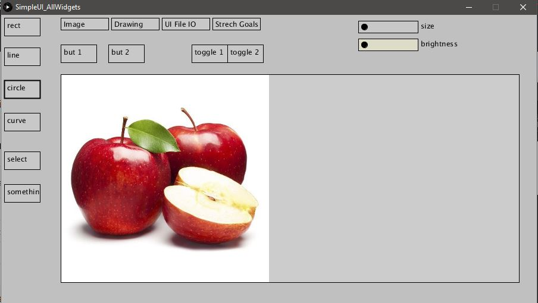

# Graphics-Coursework
A graphics editor created in Processing.js
It will open and save image from computer. 
Performing image transformations for example turning image into black and white, blur etc. 
Drawing lines, circles and other shapes. 
It's something like MS Paint. 

